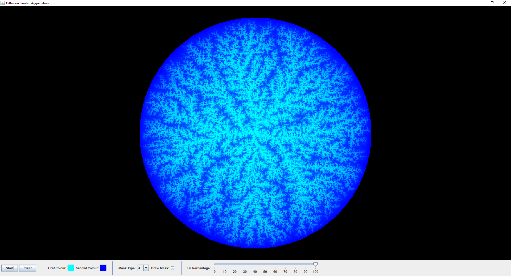
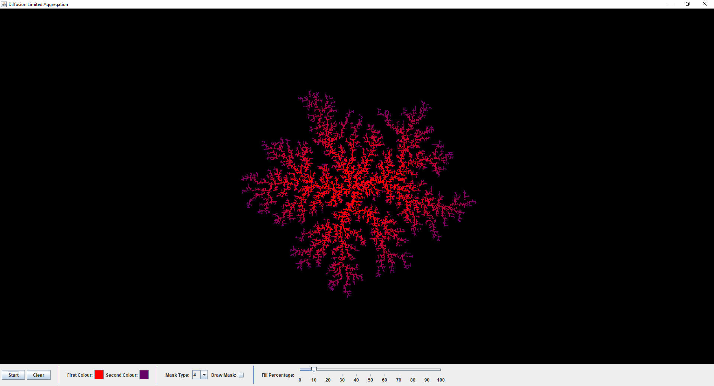
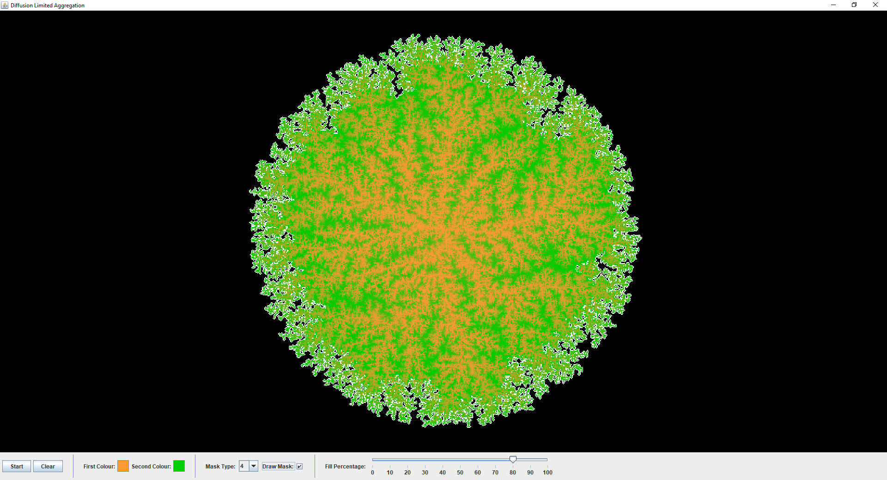

# Diffusion Limited Aggregation (DLA)
This application allows users to randomly generate unique DLA structures. A useful page explaining the concept of diffusion limited aggregation can be found at:
http://paulbourke.net/fractals/dla/

## Getting Started
This Java application was developed in Netbeans and requires the OpenGL plugin which can downloaded at:
http://plugins.netbeans.org/plugin/3260/netbeans-opengl-pack
Once the plugin files have been downloaded, open Netbeans and install the plugin by navigating to:
```
Tools > Plugins > Downloaded > Add Plugins...
```
The netbeans project can then successfully compile and run.  

## User Interface Features
The user interface allows the user to control certain parameters which can be used to influence the DLA generation process. 
This user interface was implemented with Java Swing. The user interface features include:

* Start Button - Start generating a new DLA.
* Clear Button - Clear the current DLA display.
* First Colour Selector - Select the initial colour of the DLA.
* Second Colour Selector - Select the final colour of the DLA.
* Mask Type Selector - Select the mask type which determines how the DLA structure grows.
* Draw Mask Switch - Enable or disable displaying the mask which determines how the DLA structure grows.
* Fill Percentage Slider - Modify the percentage of the full circle which will be filled [0-100]%.

## Screenshots
Screenshot 1:


Screenshot 2:


Screenshot 3:


## Licence
MIT Licence
